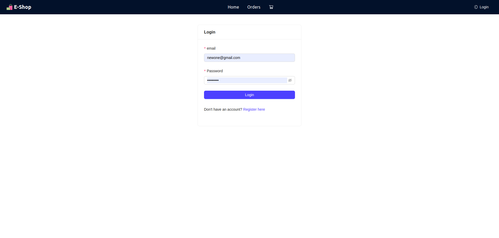
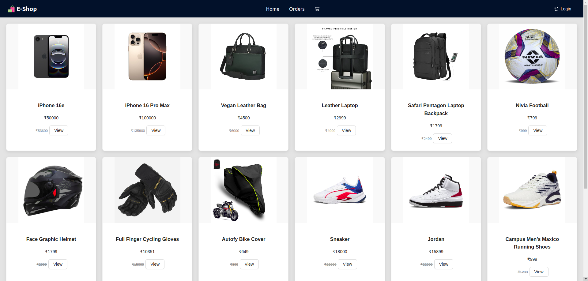
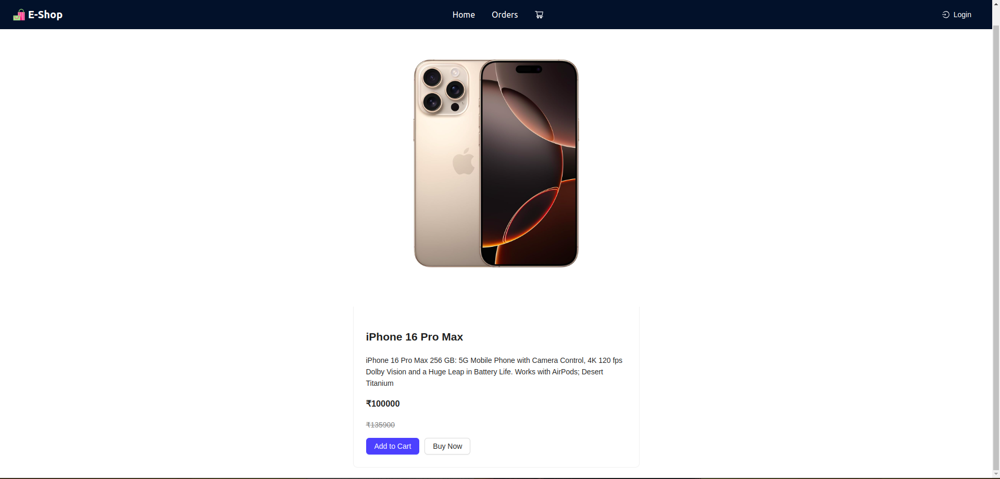
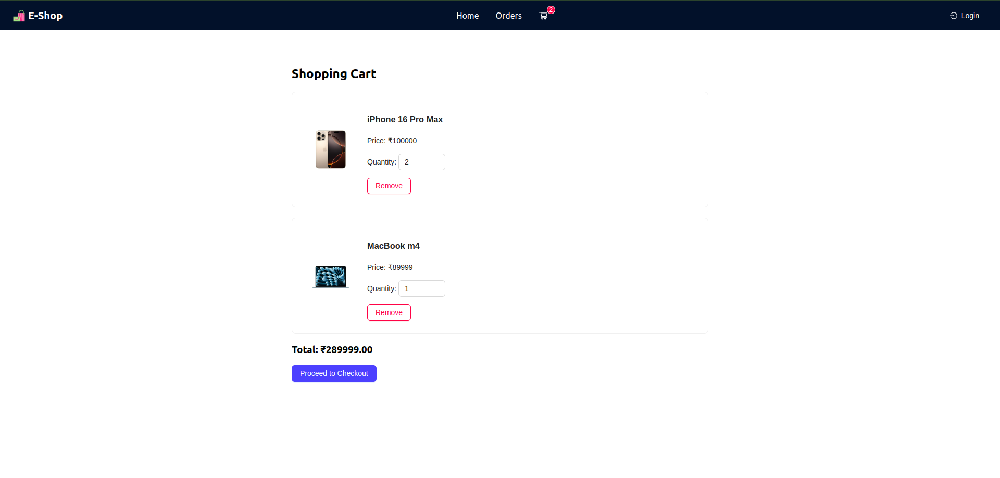
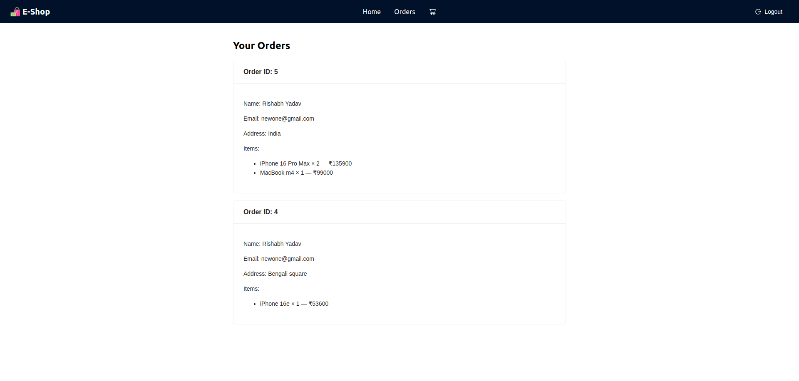

# 🛒 E-commerce Web Application

A full-stack basic e-commerce app with user authentication, product listing, cart, checkout, and order management. Built using React, Node.js, PostgreSQL, and Sequelize.

---

## 🚀 Features
- User Authentication (JWT based)
- Product & Category Listing
- Cart & Checkout System
- Order Management
- Admin: Add/Edit Products & Categories
- Responsive UI with Ant Design

---

## 🖼 Screenshots

### 🔐 Login Page


### 🛒 Product Listing


### 🛒 Product Details


### 📦 Cart & Checkout


### 📦 Order History



---

## 📘 API Endpoints (Backend)

### 🔐 Auth
- `POST /api/auth/register` – Register a new user  
- `POST /api/auth/login` – Login and receive JWT

### 🛍 Products
- `GET /api/products` – Fetch all products with pagination  
- `GET /api/products/:id` – Get product by ID  
- `POST /api/products` – Add product (admin)

### 📂 Categories
- `GET /api/categories` – List categories  
- `POST /api/categories` – Add a category

### 🛒 Cart & Orders
- `POST /api/orders` – Create new order  
- `GET /api/orders/user` – Get user-specific orders

> Most routes (except login/register) require JWT token in headers:  
`Authorization: Bearer <your_token>`

---

## 🧑‍💻 Tech Stack

### Frontend
- React.js
- Redux
- Ant Design
- Axios

### Backend
- Node.js
- Express.js
- Sequelize ORM
- PostgreSQL

---

## 🚢 Deployment

### 🔧 Backend on Render or Railway
- Push backend folder to a separate Git repo
- Configure environment variables
- Connect PostgreSQL database via hosted DB or Railway
- Start command: `node server.js`

### 🌐 Frontend on Vercel
- Push frontend folder to GitHub
- Import repo into [Vercel](https://vercel.com/)
- Set environment variable `REACT_APP_API_BASE_URL` pointing to your deployed backend

---

## 📂 Project Structure

```
UniWorld_Task/
├── ecommerce-frontend/             # React application
├── ecommerce-backend-orm/  # Node.js + Sequelize + PostgreSQL backend
│   ├── models/
│   ├── controllers/
│   ├── routes/
│   └── server.js
└── README.md
```

---

## 📝 License
This project is licensed under the MIT License.
